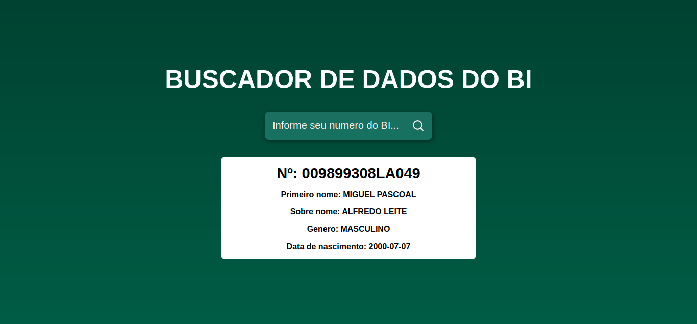

# BUSCADOR DE DADOS DO BI 

Buscador de dados do ni é um sistema que busca os dados do cidadão, consumindo o serviço da `identificação angolana`.

# Apresentação do projecto

### Tela Inicial

### Dados localizado

## FUNCINALIZADE DA APLICAÇÃO

- [x] Buscar dados do bi do cidadão

## Desenvolvido por Miguel Leite

